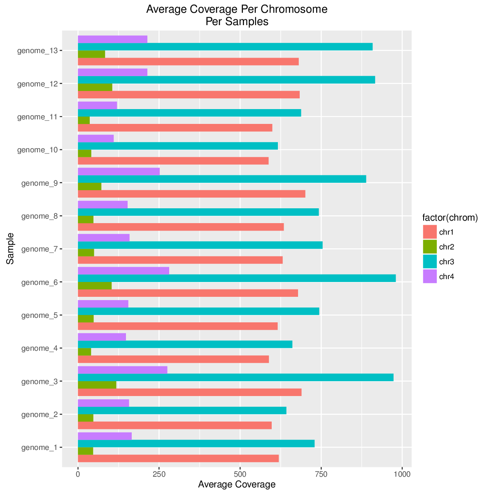

make a sample data set

```
# echo -n '' > data/depth13Genome.depth.summary2.txt
chroms="chr1 chr2 chr3 chr4 chr5 chr6 chr7 chr8 chr9 chr10 chr11 chr12 chr13 chr14 chr15 chr16 chr17 chr18 chr19 chr20 chr21 chr22 chrX chrY"
for i in $chroms; do tabix data/depth13Genome.depth.gz $i | head -10000 >> data/depth13Genome.depth.summary2.txt ; done
sort -k1,1 -k2,2n data/depth13Genome.depth.summary2.txt > data/depth13Genome.depth.summary2_sorted.txt
```

```
# make the averages file
code/average_coverages.py data/depth13Genome.depth.summary2_sorted.txt > test_output/depth13Genome.depth.summary2_sorted.averages.txt

# make the diagnostic plot of the averages
code/plot_avg_coverage.R test_output/depth13Genome.depth.summary2_sorted.averages.txt test_output/

# get the binned coverage regions
code/bin_coverages.py data/depth13Genome.depth.summary2_sorted.txt > test_output/depth13Genome.depth.summary2_sorted.bin_total_coverage.txt

```

Example output



# Dependencies

- Python 2.7

- R 3.3

- - ggplot2

- - reshape2
